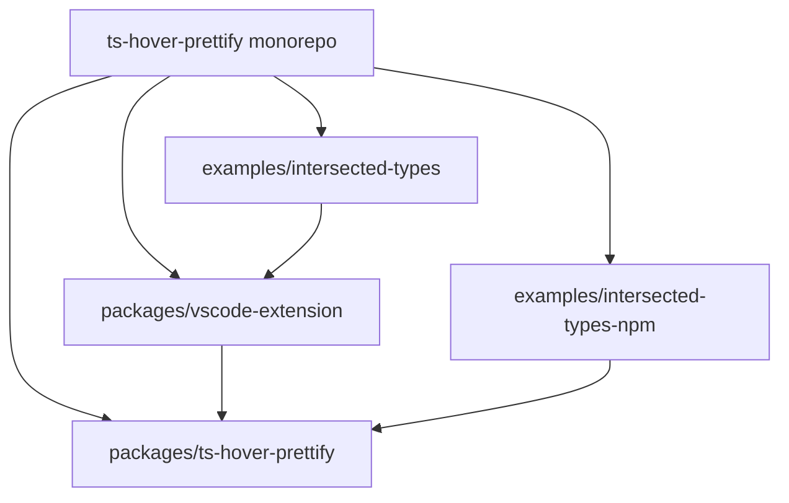

<div align="center">


# ts-hover-prettify

Flatten intersected TypeScript types in hover tooltips with `Prettify<T>`.

[](https://github.com/MarcoAntolini/ts-hover-prettify/blob/main/LICENSE)
[](https://github.com/MarcoAntolini/ts-hover-prettify/stargazers)
[](https://www.npmjs.com/package/ts-hover-prettify)

</div>

## What is this?

Without `Prettify`, hovering an intersection often shows `{ a: string } & { b: number } & …`. With `Prettify`, the same hover tends to show a single object: `{ a: string; b: number; … }`.

This monorepo ships two ways to use the same mapped-type pattern ([Total TypeScript — Prettify](https://www.totaltypescript.com/concepts/the-prettify-helper)): an [npm package](packages/ts-hover-prettify) for `tsc`, CI, and any editor, and a [VS Code / Cursor extension](packages/vscode-extension) that injects the type with zero npm setup. It affects type display only and has no runtime cost.

## Quick Start

Pick one approach per project — do not mix the extension’s auto-generated `.vscode/ts-hover-prettify.d.ts` with a manual npm setup unless you know they stay in sync.

### Extension (zero-config)

1. Install **TS Hover Prettify** (`marcoantolini.ts-hover-prettify-vscode`) from the [Visual Studio Marketplace](https://marketplace.visualstudio.com/items?itemName=marcoantolini.ts-hover-prettify-vscode) or [Open VSX](https://open-vsx.org/extension/marcoantolini/ts-hover-prettify-vscode).
2. Open a TypeScript workspace and wrap types with `Prettify<…>`.
3. Hover the alias. Run **TypeScript: Restart TS Server** if hovers do not update after install.

Details: [packages/vscode-extension/README.md](packages/vscode-extension/README.md).

### npm package

```bash
pnpm add -D ts-hover-prettify
```

Add a declaration file included by your `tsconfig.json`:

```typescript
import "ts-hover-prettify/global";
```

Details: [packages/ts-hover-prettify/README.md](packages/ts-hover-prettify/README.md).

### Example

**Before** — intersection shown as chained `&` types:

```typescript
type Intersected = { a: string } & { b: number } & { c: boolean };
// Hover: { a: string; } & { b: number; } & { c: boolean; }
```

**After** — wrap with `Prettify` where you want a readable hover:

```typescript
type Intersected = Prettify<
  { a: string } & { b: number } & { c: boolean }
>;
// Hover: { a: string; b: number; c: boolean; }
```

Runnable demos: [examples/intersected-types](examples/intersected-types) (extension) · [examples/intersected-types-npm](examples/intersected-types-npm) (npm).

### Development

Requirements: Node.js 16+, [pnpm](https://pnpm.io/) 8.

```bash
pnpm install
pnpm build
pnpm lint
pnpm verify:example-extension
pnpm verify:example-npm
pnpm package:extension   # VSIX → packages/vscode-extension/build/
```

Local extension debugging: open `packages/vscode-extension`, press **F5**, then open `examples/intersected-types` in the Extension Development Host.

## Architecture



## Project Structure

```
.github/
  workflows/
.changeset/
examples/
  intersected-types/
  intersected-types-npm/
packages/
  ts-hover-prettify/
  vscode-extension/
scripts/
CHANGELOG.md
LICENSE
package.json
pnpm-lock.yaml
pnpm-workspace.yaml
turbo.json
tsconfig.json
```

## Documentation

| Resource | Description |
|----------|-------------|
| [packages/ts-hover-prettify/README.md](packages/ts-hover-prettify/README.md) | npm install, global setup, and API |
| [packages/vscode-extension/README.md](packages/vscode-extension/README.md) | VS Code / Cursor extension usage |
| [examples/intersected-types](examples/intersected-types) | Extension workflow demo |
| [examples/intersected-types-npm](examples/intersected-types-npm) | npm + `tsc` workflow demo |
| [CHANGELOG.md](CHANGELOG.md) | Release history |

## What this does and does not do

**Does**

- Improve hover (and related quick info) for types you explicitly wrap in `Prettify<…>`.
- Work with strict TypeScript projects; the utility type is a few lines of types-only code.

**Does not**

- Change runtime values or emitted JavaScript.
- Rewrite hovers for types you never wrapped (aliases, inferred types, etc. stay as TypeScript prints them).
- Replace dedicated “expand any hover” extensions or VS Code’s experimental expandable hover (`typescript.experimental.expandableHover` with a recent TypeScript workspace version).

## Release

| Artifact | Mechanism |
|----------|-----------|
| **npm** (`ts-hover-prettify`) | [Changesets](https://github.com/changesets/changesets) on `main` / `master` — [`.github/workflows/publish.yml`](.github/workflows/publish.yml) |
| **Extension** (`ts-hover-prettify-vscode`) | Git tag `vscode-v*` or manual workflow — [`.github/workflows/publish-extension.yml`](.github/workflows/publish-extension.yml) |

## Contributing

Issues and pull requests are welcome on [GitHub](https://github.com/MarcoAntolini/ts-hover-prettify).

<a href="https://github.com/MarcoAntolini/ts-hover-prettify/graphs/contributors">
  
</a>

## License

[MIT](LICENSE) — Copyright 2026 Marco Antolini.
